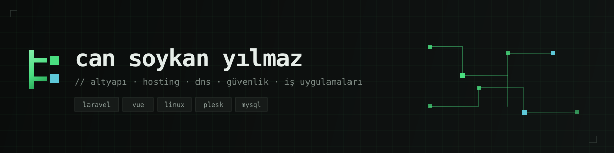

 

Kurumsal BT tarafında çalışıyorum: sunucu ve hosting altyapısı, alan adı/DNS
yönetimi, ağ güvenliği ve bunların üzerine oturan iş uygulamaları. İşin hem
altyapı hem yazılım ayağıyla ilgileniyorum — bir CRM'in Laravel tarafını yazmakla,
o CRM'in üzerinde koştuğu sunucunun yedekleme politikasını kurmak benim için aynı
işin iki parçası.

 

### Çalışma alanlarım

| | |
| :-- | :-- |
| **Altyapı & hosting** | Linux sunucu yönetimi, Plesk, sanallaştırma, yedekleme ve felaket kurtarma kurguları |
| **Domain & DNS** | Alan adı yönetimi, DNS kayıt tasarımı, sertifika ve e-posta doğrulama kayıtları |
| **Ağ & güvenlik** | Güvenlik duvarı politikaları, erişim sertleştirme, izleme ve olay müdahale |
| **İş uygulamaları** | Laravel + Vue ile CRM ve varlık yönetimi platformları, muhasebe/ERP entegrasyonları |
| **Otomasyon** | Zero-touch kurulum, dağıtım hatları, tekrar eden operasyon işlerinin otomasyonu |

 

### Kullandığım teknolojiler

 

### Yayımladıklarım

**[Vaultline](https://github.com/csyio/vaultline-app)** &nbsp;

&mdash; macOS için yerel, sıfır‑bilgi şifre yöneticisi. Parolalar tek bir
şifreli dosyada, kullanıcının kendi makinesinde kalır: sunucu yok, hesap yok,
senkronizasyon yok. Argon2id + AES-256-GCM; kriptografi Rust tarafında,
arayüzün dosya sistemi ve ağ erişimi yok. Apple Developer ID ile imzalı ve
notarize edilmiş.
&rarr; `brew tap csyio/vaultline && brew install --cask vaultline`

**[Rootline](https://github.com/csyio/rootline)** &mdash; MSP/hosting
sektörünün terimlerini öğreten, sektör gündemini takip eden ve döviz kuru gibi
günlük araçları tek yerde toplayan Türkçe uygulama. Tek dosya, sıfır bağımlılık;
ikonlardan grafiklere kadar her şey el yapımı.
&rarr; [rootline.cansoykanyilmaz.com](https://rootline.cansoykanyilmaz.com)

 

### Üzerinde çalıştıklarım

**Kurumsal Linux dağıtımı** — Ubuntu tabanlı, markalı, zero-touch kurulan bir
kurumsal masaüstü dağıtımı. Kurulum sonrası elle yapılandırma gerektirmiyor.

**CRM ve varlık yönetimi platformları** — Laravel ve Filament üzerine kurulu,
muhasebe servisleriyle entegre çalışan; web formundan faturaya kadar süreci uçtan
uca kapatan iş uygulamaları.

 

### Yapay zekâ ile geliştirme

> Projelerimi **Claude** (Anthropic) gibi yapay zekâ destekli geliştirme
> araçlarıyla birlikte hayata geçiriyorum — tasarımdan koda, altyapıdan
> otomasyona kadar. Kararlar ve yön bende; hız ve kapsam yapay zekâ desteğiyle.

 

### Bağlantılar

 

---

 

### English

I work in enterprise IT: server and hosting infrastructure, domain/DNS
management, network security, and the business applications that run on top of
them. I work on both sides of that line — writing the Laravel side of a CRM and
setting the backup policy for the server it runs on are, to me, two parts of
the same job. Based in Türkiye.

**What I've shipped**

- **[Vaultline](https://github.com/csyio/vaultline-app)** — a local,
  zero-knowledge password manager for macOS. Passwords stay in a single
  encrypted file on the user's own machine: no server, no account, no sync.
  Argon2id + AES-256-GCM, with the cryptography on the Rust side and no
  filesystem or network access from the interface. Signed with an Apple
  Developer ID and notarized.
- **[Rootline](https://github.com/csyio/rootline)** — a Turkish-language
  reference app for MSP/hosting terminology, industry news, and daily tools.
  Single file, zero dependencies; everything from the icons to the charts is
  hand-made.

Mostly Laravel, Vue, Rust and Linux. Reach me at
[info@cansoykanyilmaz.com](mailto:info@cansoykanyilmaz.com).
